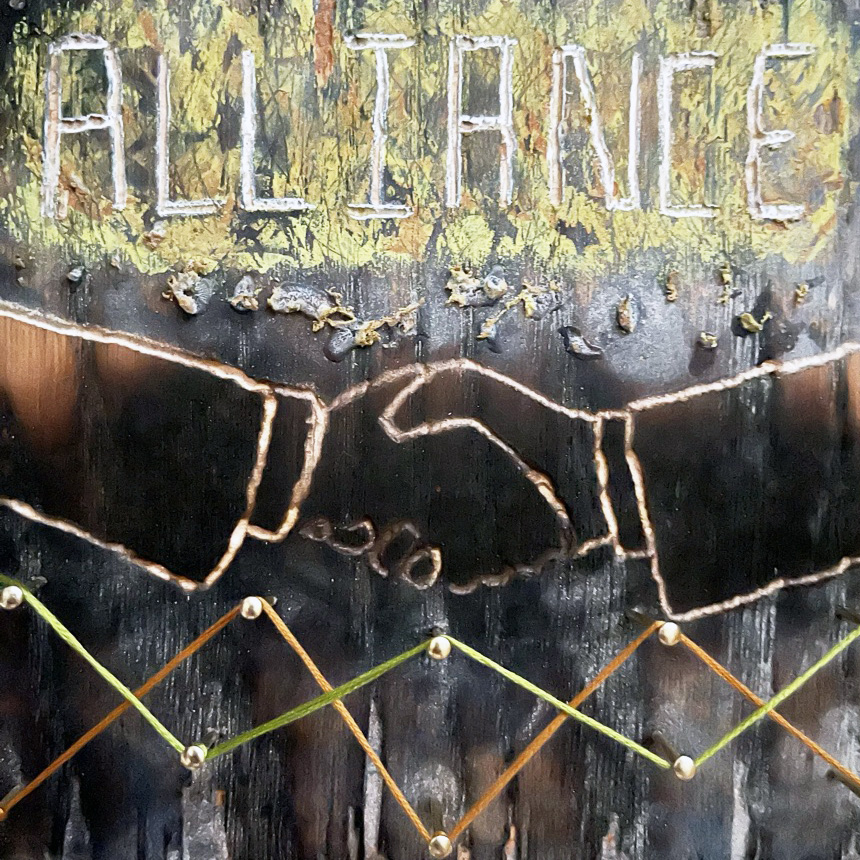
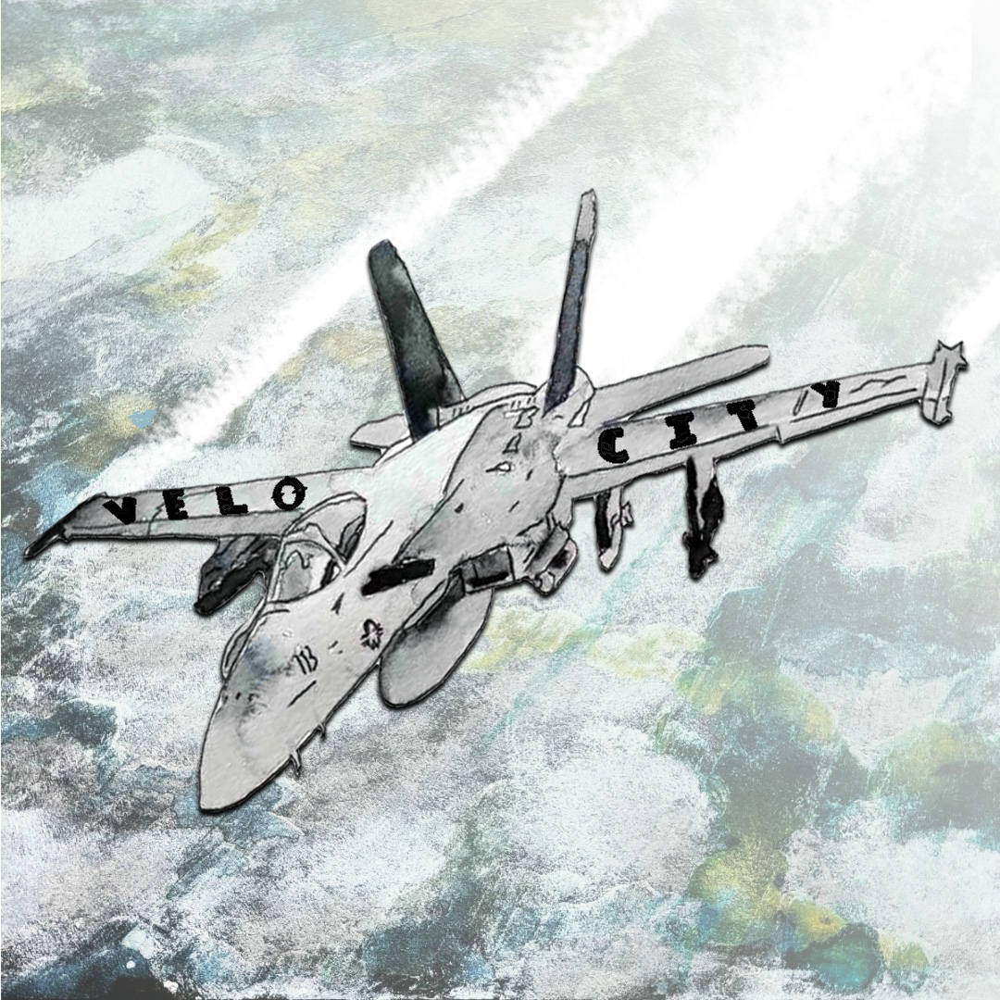
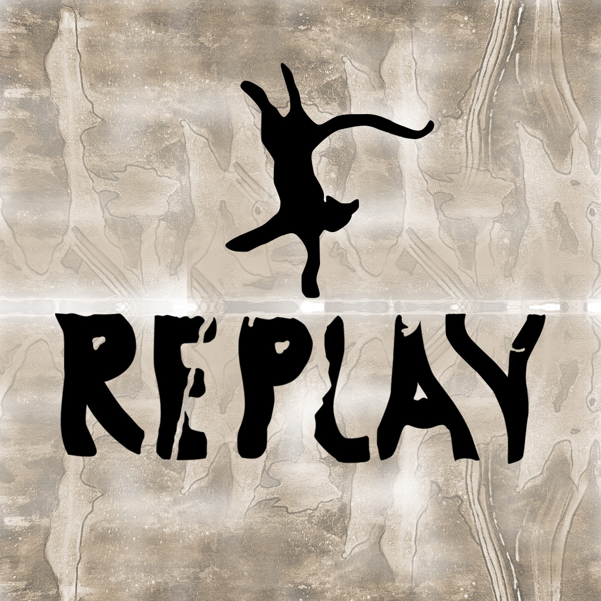
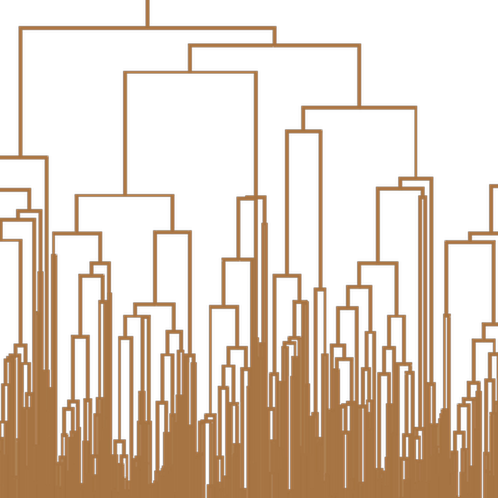
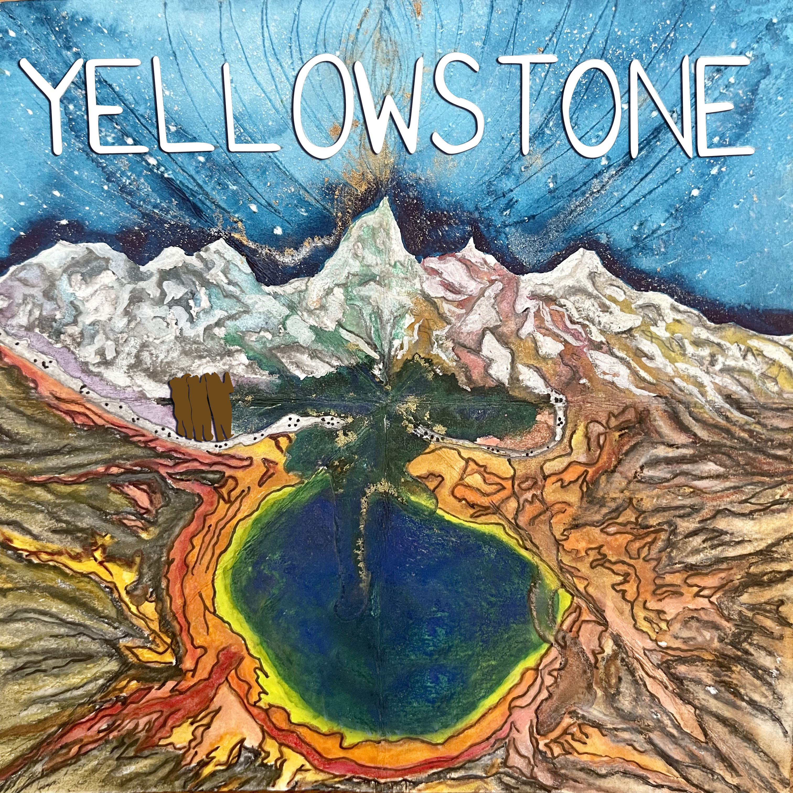

# Music — Links & Credits

## Spotify

**Arjun Raghuraman (solo project)** — https://open.spotify.com/artist/7CUffj4UUmj0XznIHlEtvt

**First Principles** (collaboration with a second musician, https://vishsubramanian.me/) — https://open.spotify.com/artist/6MWB66eYXF5K2b51y0uPja

**Sugar Loaf Walker** (bass player) — https://open.spotify.com/artist/62qGJFvCYDyY03J9kLumly

*(Track links above are the clean canonical URLs, tracking parameters stripped for the site.)*

## Now

Working through snare drum rudiments, and using them to sharpen three-finger and two-finger right-hand technique on bass.

## Personal Project — Collaborators

*(For the solo project only.)*

- **Drums** — Vinay, based in India — https://www.instagram.com/vinayrk
- **Guitar** — Vivek Ayer (https://open.spotify.com/artist/21Y0vTeAmQ9SNqNvRT22bq) & Vishwanath Subramanian (https://vishsubramanian.me/)
- **Sound engineering** — Kevin Carafa, based in Portland (paid engagement, highly recommended) — https://www.fiverr.com/kevincarafa

## Artwork Credits

*(Spans both the solo project and First Principles.)*

- Katie (https://www.instagram.com/thepathsleadingbacktome) — Falcon Funk, Blue Nile, Alliance, Velocity, Aqua Regia (solo project), and Replay and Yellowstone (First Principles)
- Cluster (First Principles) — generated with Wolfram Language: a dendrogram (hierarchical clustering diagram) built from random data, cropped and processed into cover art
